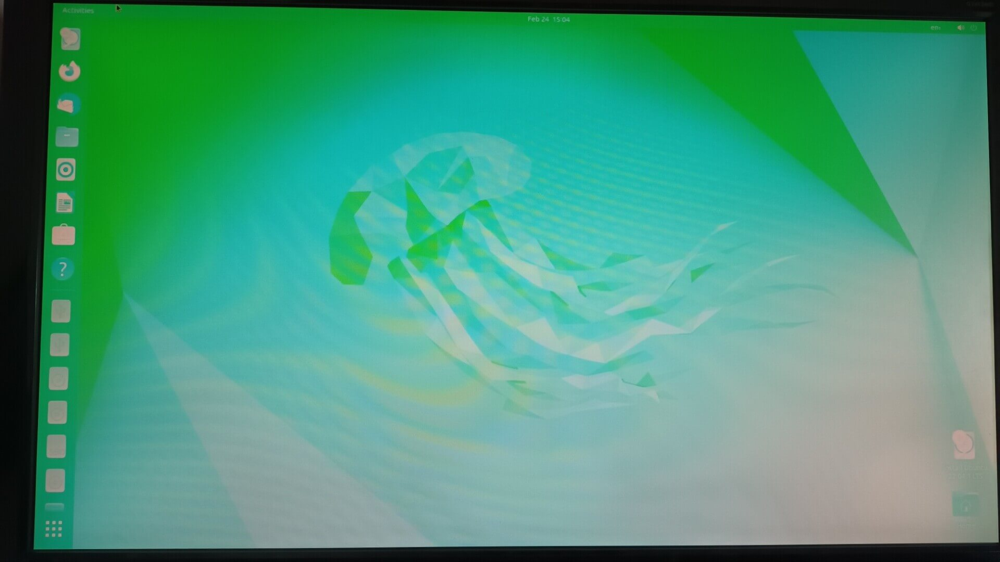

**Update 2025-01-09: NVIDIA has fixed most of the issues since and I have moved on to Arch. It's still not the best experience on Linux, but at least you can use your computer properly. Consider this a relic of the past.**

Ever since I kinda have "my own PC", my hardware is always several generations behind, whether it's CPU or GPU.
However last Friday I got an NVIDIA GTX 1660 SUPER, which is going to replace my GTX 650 Ti BOOST 1GB (Coincidentally it is released almost exactly 1 decade ago).

This card was actually a mining card by &lt;undisclosed member somewhere in my family tree>, and it still seems to be in good condition.
This upgrade is also a massive upgrade and it marks the first time I am using a so called "mainstream" GPU card that is still well within the support period.

Now the NVIDIA GTX 650 Ti BOOST has served me rather well, but the main issue is that my variants only has 1GB of VRAM. Open up a browser on Windows and you're using almost 800MB/1GB, open up any game and you're doomed to swap with the System RAM which heavily tanks the performance and are not even using the GPU to the full potential. But I've been doing less gaming lately so that is still "workable".

Anyways the first thing I did is just boot into Windows, as I know there (usually) won't be any problem setting up the driver there, and it did work out as planned. Within a minute the driver gets installed automatically and I am now rocking with an 1660 Super with no issues.

Now it's time to reboot into Linux. I know for a fact that NVIDIA driver on Linux is a pain, but considering my old GPU haven't really gave me "too" much issue I thought that the worst scanario is just purging my old NVIDIA legacy driver then reinstall it with the new one.

I waited, and waited, hoping I would at least see the KDE Plasma Splash Screen... wait did the screen freeze?
This is still within my expectations (Even if annoying), so I tried switching to another tty and remove all the NVIDIA stuff there, except that it seems my entire system just locked up and nothing works.

Okay well let's reboot into recovery mode and hope it works there, but then I realized I've set my GRUB timeout to be 0s. I know that you can press "Shift" or "Esc" to force GRUB to appear, however I know this doesn't work at least under my configuration for whatever reason. Resetting the GRUB Timeout is somewhere on my todo list for a long time so I can actually boot into recovery mode when needed, but everytime I just dismiss it and finds something better to do. Well now it came back to haunt me.

Well alright, at least I still have my Ventoy USB. I am going to boot into Ubuntu Live then modify the grub config there... what in the world is this?

Yes it is still perfectly usable apart from the green tint, but this is already a big downgrade as none of this happens with my previous (also NVIDIA) GPU and it's just a terrible experience. Anyways I did finally get the GRUB menu to show up and entered recovery mode, and now I can finally uninstall the old NVIDIA Driver.
After rebooting I am back on Plasma desktop with nouveau, which sucks in performance but are still better than the whatever NVIDIA nonsense I just had.

So let's re-install the latest NVIDIA driver and it should work right? I rebooted and well I was greeted with the exact same issue. Black screen, nothing responds.
I don't know what to do, does this card just don't work on Linux at all? That is until I remembered I saw a post on the fediverse that says he can't get NVIDIA KMS to work and he can't use Wayland because of that.
This probably have nothing to do with my situation, but my session is set to auto-login to Wayland, maybe newer NVIDIA GPU just don't work with Wayland?
So I modified the sddm config so that it would login to the X11 session instead, and yup that worked! (Which basically means I can no longer use the Wayland Session, which have massive performance improvements over X especially after the 5.27 update).

Also, because NVIDIA is now my main GPU, all my xrandr script no longer works and I have to rely on NVIDIA's decade old "X Server Settings" (That's probably at least around 2008 or something) to tweak it. That settings panel would resize the window itself on some specific tab because apparently scrolling no longer exist. Clicking "Save to X Configuration File" doesn't account for PRIME monitor, and apparently you must launch nvidia-settings on startup just for your color profile to get applied???

All my existing QEMU VM that utilize virtio gpu also no longer works under UEFI, so I either have to reinstall all of them with Legacy BIOS or just use QXL which is rather slow and not suitable for when I actually need to get stuff done.

It's just sucks that NVIDIA makes the most advanced and popular GPU, yet they are just uncooperative at everything, making using NVIDIA GPU on Linux second class and devs and user spending more time dealing with NVIDIA specific quirks. This is an inferior product especially in contrast to Red and Blue Team where they both would work out of the box under Linux with absolute 0 configuration, everyone is happy.
