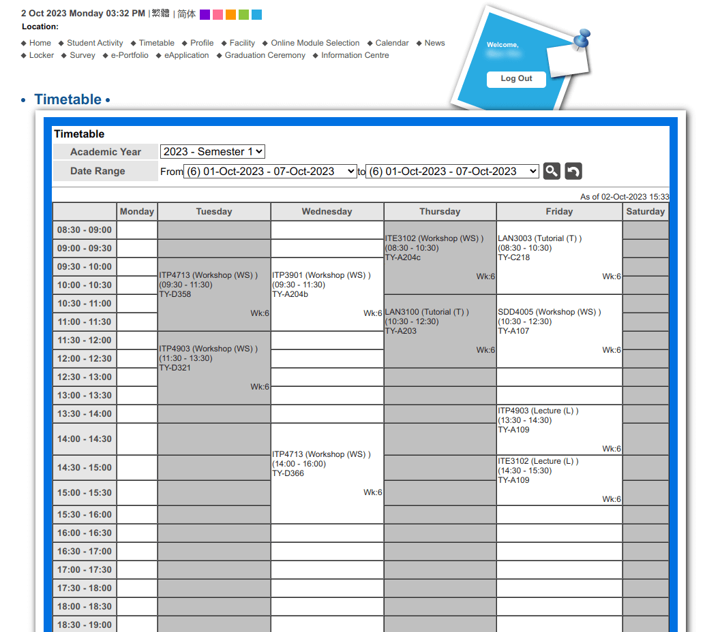
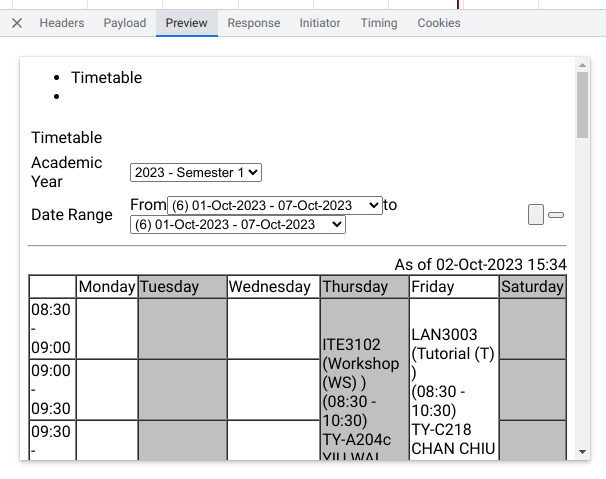
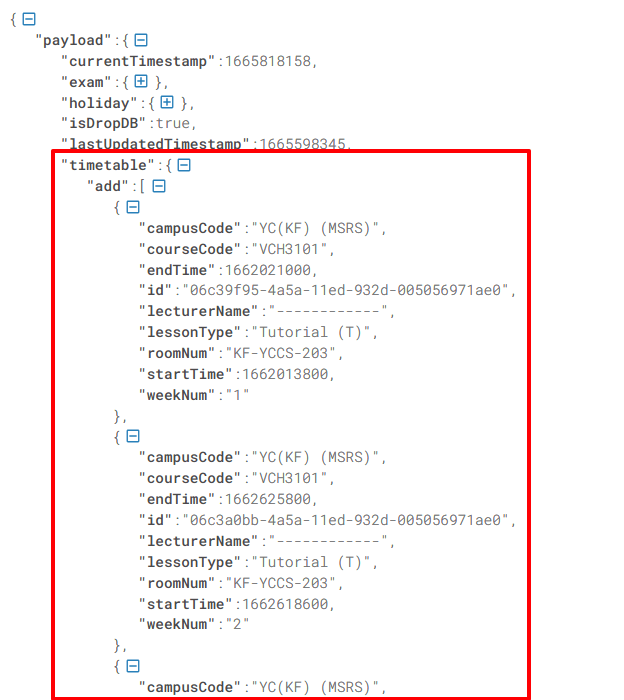
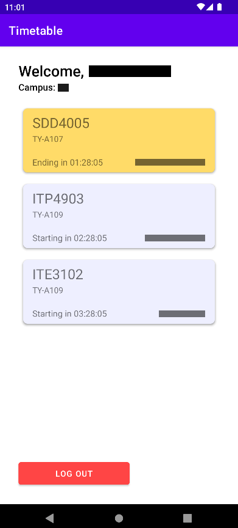
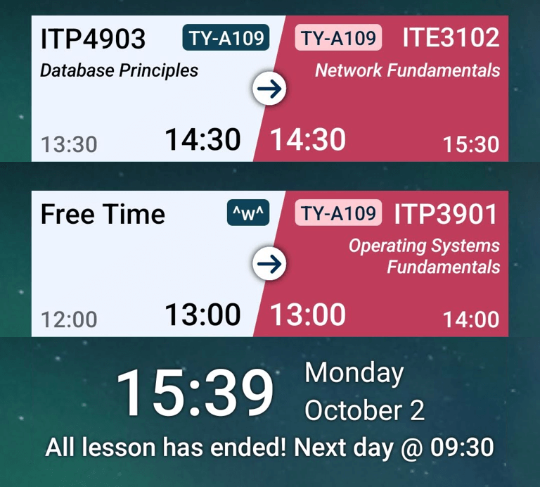

A while back I vented a bit over on twitter (Now X):

As with my other venting tweets at the time, I have briefly thought about doing something with it, but ended up being too lazy to care and moves on.

That is until the next day, one of my friend sent me a picture of their home screen with a widget showing the current and the upcoming class information, the location and the time period of their school.

Yes it isn't a static notification I was initially expecting, but nevertheless it does the job, and it does it quite well, so I started looking for a way to achieve the same with my school.

I obviously don't want to manually enter each course, otherwise it would be a PITA on every new semester (And also as it turns out, occasionally the classroom would shift depending on different weeks), so I have to figure out a way to get the real-time class schedule from the school.

## Figuring out the API
My first instinct would be to get the timetable from our school's portal website, which looks like it's something made in 2004.

In the portal, you can request a week (Or multiple week, but it doesn't work on student account as far as I am aware) of timetable, it then sends an AJAX call and the server returns back the timetable page in HTML.

Thanks I hated it! Sure if I really want to reverse engineer this thing I probably could have figured it out somehow, but why go the hard way when there's an easy way, so I started digging through the school's mobile app (Which is what my original tweet is targetting anyway).

With the help of old insecure android version in an emulator & mitmproxy I did get the endpoint, got it to authenticate (Just some basic username password authentication) and obtained the timetable data, now in JSON!

Good, now let's actually build the app.

## What the &#@\ is this thing
When I first started this, I have absolutely no android app developing experience. I haven't tried Kotlin before, I have no idea what is an Activity, Fragment, Intent, the only time I ever touched Android Studio is for their Android Virtual Device.

I am not going to go through how I learned them as that isn't the main point (And if anything I shouldn't be the one qualified to document them), but overall my impression of native Android Development is that you need to be willing to learn a lot of concept rather than expecting things to work after maybe copying a few lines of example code then using it. (Especially Intent/Broadcasts), and that now all of a sudden React Native doesn't seems that crazy after all.

Anyways a few weeks in, the app is now in a functional state, I can log in to a school account, it will display the course appropriately, everything works.

Except for the static notification, which is the whole point of the app.  
Either the notification doesn't get updated, the timer is wrong, etc.  
I've spent weeks tinkering with it with no success, so I left the entire app in the dust and moved on with my life.

That is until around a year later when a new school year began, that means I have to completely re-adjust my schedules, and that also means having to pull up the timetable image/mobile app on every lesson change to know where am I suppose to go, and start memorizing it all over again.

Eventually I am fed up, so I decided to make the class schedule app again, this time in the form of android widget (Which I should have been in the beginning).  
Note that I have since graduated and was no longer in the school I was previously in, but it is still under the same organization and they use the same system, so all the knowledge I've discovered a year ago still applies!

And after a week of bashing my head against the computer, it has finally been done.

It's not fancy nor polished at the moment, it doesn't properly display across months, it likely doesn't support having multiple widget at once, nor does it handle holiday and exam schedule (Which the official school mobile app does).

But I am very happy with the end result, using and solving my own daily life problems/annoyances are always the best, this is one of the few projects that I get to do so, and I very much enjoy it :D

For now I don't think I will continue devote a lot of time to this widget, primarily I am not sure how happy my school would be if I distribute this thing, and tbh it's enough for my usage, although I hope it will reach a production-ready state one day.

That's about it, see you in the future :^)