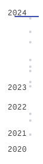
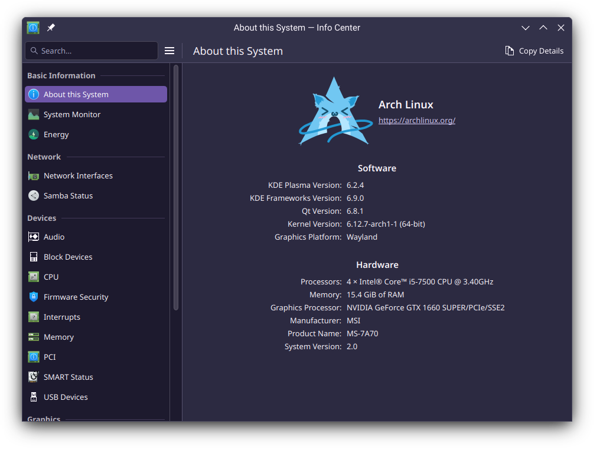
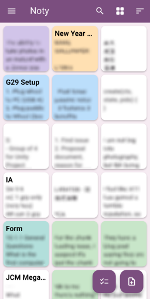
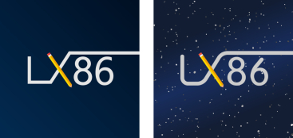
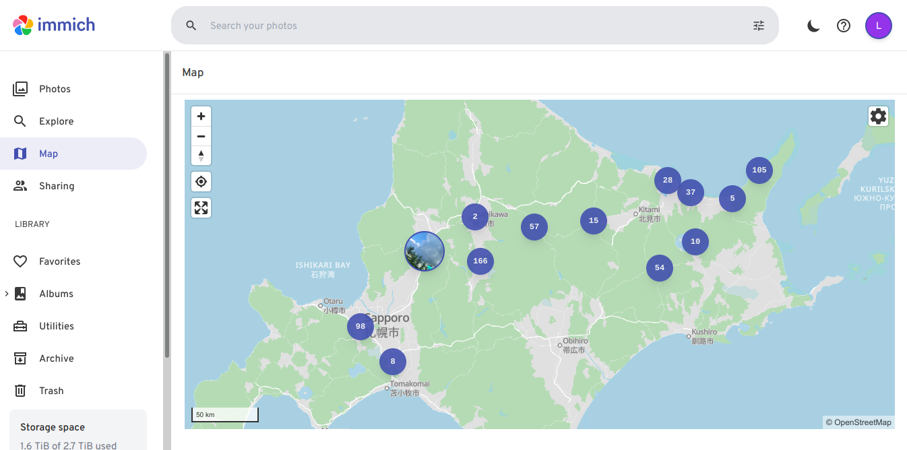

Of course it's 31st December and of course I never realize time passes that quickly, but as *some of you might know*, 2024 is coming to an end. So I've decided to do a recap of this year so far:

# The 2024 Recap

## I took more photos!
2024 by-far have the most photos I have ever taken:

To be fair it's probably inflated due a 7-day trip to Japan this summer, which in of itself contains over 700 photos. But even without accounting for that, it's still way more than 2023.  
Much of that comes from random observations around Hong Kong, and it's fascinating how much stuff we walk by without noticing.

So next time you travel along your routine journey, try be more observant of the things around you, and maybe you'll discover interesting stuff as well!

## I installed Arch!
I might write a short post on this later when I have time, but the TL;DR is that I switched my main desktop from Debian 12 to using Arch Linux in around June, so now I can officially claim that *i use arch btw*.  
<small>(And in-case it isn't obvious, the best OS is the one that gets the job done, I couldn't care less about the whole arch elitism thing!)</small>

But seriously for the past 6 months it has served me really well, almost everything works out of the box without me spending time on "why doesn't this work" and "why this is laggy".
Will it continue to help me actually get stuff done? Time will tell, but one thing is for sure: I am in dire need of more ssd disk space :)

## Academic
This year is really, really busy and stressful academic-wise.

Most notably, I have to team up with a group of 4 to build a 3D game in Unity as part of a school project. In reality however, 3 of them often don't come to class and they don't actually know anything and keeps handing in garbage. This means I am the one who have to write the report documents, testing, design artwork, program all the game logics, user interface, animations, sound effects etc.
Along with a not-so-friendly teacher, this has unfortunately made a negative contribution to my mental health, lowered my self-esteem and had isolated myself from others due to constant stress I have to face irl, which I don't think I have really recovered since :(

On the plus side, the final grade I got for that project is not *that* bad, and now I get to know how to do literally everything mentioned above. Oh and I also got new groupmate that are friendly and actually do stuff, so let's see how this time will go~

## I reversed engineered a mouse for use in Linux!
And yet somehow despite spending much of my time for school work, I am able to crunch out some time to reverse engineer and build a mouse utility on Linux just so I could have those fancy RGB lights going weeeee~

[I have written a full blog post on that if you're interested](/blog/2024-05-13-reverse-engineering-a-mouse)

It was fun and certainly new for me, maybe I'll do it next time, when I swap out my peripheral again that is!

## Misc
### I replaced my Note App!
As someone who pretty much never take proper notes because it never works on me, I have grown accustomed to the app [Color Notes](https://play.google.com/store/apps/details?id=note.colornote). Essentially it's a plain text note app that's so simple it's pretty much just a detailed reminder for your future self.  
It has served me quite well over the years, however 2024 is really not a good year with companies shitting themselves all over the place, so naturally I try to avoid any form of technology lock-in whenever possible. On top of that, I've also discovered that the app is made by a gambling company, and the inclusion of ads (Which isn't a big deal, but is annoying nevertheless when misclick happens) just made me want to move away from it.

So I wrote my own note app to replace it, both because I was intending to replace it anyway, and I also want to try using Flutter for this app. (Which feels nice, although library and system integration is definitely not the best)

Granted there are still features missing from Color Notes, but for now this will do. I'll see if I can get it to a reasonable enough state to turn this into an actual side project.

### I changed my profile picture
That in of itself shouldn't be worth mentioning, but I really liked the outcome, and also this blog post is about me anyway:

The new one is somewhat of a representation of space/galaxy with bunch of stars. Of course take that what you will, but I think it looks convincing enough from a far distance/small picture, just my humble opinion :)

One quirks of the new profile picture is that not every website displays image equally, most notably on websites that scales their image down using nearest neighbors. This would make all the "stars"  plain white dot all over the place and would ruin the pfp.

I ended up having to make an alternate version with dimmer stars to accomodate for these websites.

But overall I think I am pretty satisfied. It's still not as humanizing as, let's say an anime girl profile picture, but I have no better idea at the moment. Maybe I can get away with spamming more emoticons for the time being? >w<

### I rebuilt this blog
And finally, the blog you are seeing right now (or not if you are using a RSS reader) has been rebuilt! It also incorporates the design of the new profile picture mentioned above as you might have noticed from the top of the page.

Check out [I rebuilt the blog again](/blog/2024-10-16-I-rebuilt-the-blog-again) to learn more!

## Softwares
FOSS and Proprietary software still dominates at their respective category like usual, and for my use case there isn't a huge shift. However there are a couple of shoutouts:

### [Immich](https://immich.app)
Self-Hosted Google Photos! Recently my Whatsapp backup started counting towards my Google Drive space, and my google account is running out of space quickly.  
This became a major headache, at first I used a combination of DS Photos and DigiKam to manage my photos, however it's also clear the UI is not that friendly, everything is just not as convenient.

That's when I first discovered Immich. Apart from being a self-hosted Google Photo alternative with similar UI, it also offers face recognition which as far as I am concerned, works almost 100% of the time, or at the very least haven't accidentally grouped the wrong people in, even behind a cage that is!

Another really neat feature is the world map, which shows the places where you have taken photos in (Assuming you have enabled reverse geocoding and enabled location tag in your camera app)

So really nice stuff. For now it's still not going to be useful for the average users who don't care about selfhosting, but at least it feels like a genuinely competent *(albeit still WIP)* project that doesn't hold my data hostage, and I am really happy to have switched over to it.

Would definitely pay when I can sustain financially by myself.  
<small>(Because surprise surprise, FOSS developers also need to eat!)</small>

### [Thunderbird](https://thunderbird.net)
An email client! Still far from polished, but made good step forward, most notably the Card View introduced in Thunderbird 115 is a game changer.  
Unfortunately I still can't send any outgoing mails with my school's Microsoft 365 account, so we will have to see can [Exchange Support](https://wiki.mozilla.org/Thunderbird:Exchange) land before my graduation!

### [Rustdesk](https://rustdesk.com)
An open-source remote access/control software. For the most part I don't really have any complaints and it just works like any other proprietary software like AnyDesk without any hassle configuring this and that.

---

Overall, academic still dominates the majority of my energy this year. It feels like an unproductive year with not a lot going on, but turns out it's not always the case, just being overshadowed by negative things which is much, much more memorable.

# Looking forward
When I was still small, I always have a grand envision that each new year is gonna be better, everything is gonna start over and my luck counter is gonna reset.
As I grow up however, that hope and magic feeling just isn't there anymore.

Perhaps I saw through the fact that a date is just some arbitrary numbers defined by humans, and the world doesn't change because a number is bumped by. In any case I've decided to finally take things on my own hand again:

For the first time in <small>(I don't actually know)</small> years, I have decided to set out a new a new year resolution, because if nothing else provides the help, I will be the help, to help myself. And so here it is:

## Stop pushing myself to the corner
As mentioned previously, my mental health has declined by a lot. Nowadays I usually only resort to 2 of my friend, and even then the conversations usually never goes this deep. This blog is probably the most personal thoughts that I could have written.

With the currently very (and I mean very!) low self-esteem, I am not sure how much could be done, but I'll try to join and engage in communities that I otherwise would have never done so.

## Drink more water
Pretty self explanatory. I've always felt like my physical health is in decline over the years, and while I should actually just do physical activities, this is hopefully a good and easy first step towards fixing my health.

(p.s. No I don't do soft drinks, I just don't drink)

## Never defer alarm clock
...I know I know. Being late to school is a recurring pattern that's becoming more and more common this year.

While I do have a physical alarm clock placed next to my bed to wake me up, I usually approach things in a very conservative and redundant way. In this case, setting the alarm clock to be 30 minutes before I actually need to wake up.
This is originally intended to give myself some buffer in the event that I am simply way too sleepy. Of course in hindsight this is a stupid decision, because then I just got used to keep deferring the alarm clock everytime it tries to wake me up, ...and then I became late...

So starting from 2025, no buffering anymore, and I have to immediately get up. This is gonna take a while to get used to, but ultimately I hope it's beneficial in the long term. (You might be late for class, but not in workplace!)

## "No" is ok. Don't fool others, and yourself.
Assigned ID: CVE-1231  
Score: 10/10!  

Again, really vulnerable stuff that could be easily abused and taken advantage of, hope to patch that up this year, ideally even ASAP.

---

So not a lot of grand envision and goals into 2025, but I just wish to feel better in my everyday life.  
Thanks for reading til the end, and I will see your next year, take care <3