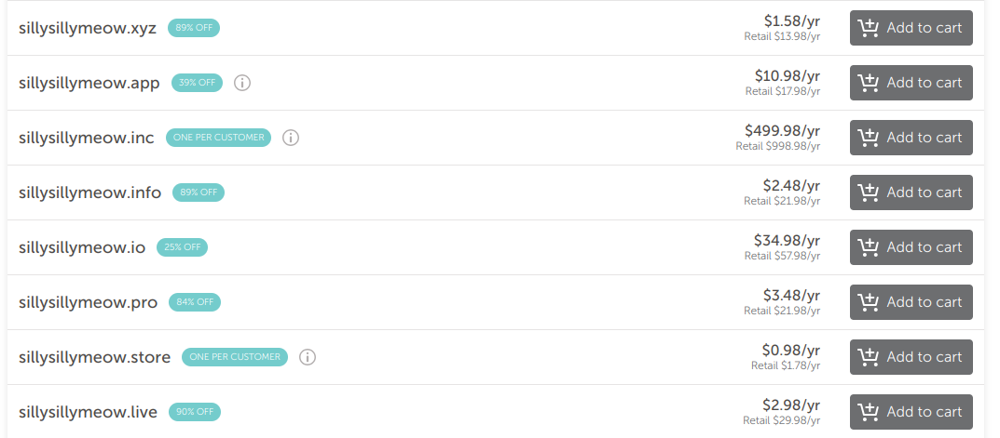

import Currency from "../../../components/blog/Currency.astro";

I've owned this domain, `lx862.com` for around 2 years now, and I thought I'd like to give some insights as to what are the factors of getting a domain, and what to take notes of.

# Why even bother with a domain name?
If you do a quick google search on why should you get a domain name, there are plenty of websites describing that... with the catch that most of them pertains specifically to businesses & startups, not for individuals.

When I initially registered this domain, it's really nothing other than "Look at me i am cool!!!", and I think that's most people's first impression as well.  
However over the past few years, companies just [cannot stop shooting themselves into the foot](https://en.wikipedia.org/wiki/Enshittification) to a point where I just don't think I can really "count" on any specific platform with my online presence anymore. Owning a domain gives me the flexibility to move off any platform/services as I see fit, while still retaining the same domain name I uses.  

It can also be used for verification purposes. For example Mastodon allows you to [verify that your account owns a domain](https://fedi.tips/how-do-i-verify-my-account), and Bluesky allows you to do the equivalent of [setting your domain name as your username handle](https://bsky.social/about/blog/4-28-2023-domain-handle-tutorial).

# Choosing a TLD
Top-Level Domains (TLD for short), at its simplest form refers to the last bit of a domain, typically `.com`, `.net`, `.org` etc.

Overtime people have done creative stuff with TLD, for example Minecraft's `server.properties` file is available at [https://server.properties](https://server.properties), where `.properties` is the TLD here.

I have thought of getting a domain with some fun TLDs, but ultimately this domain is basically my little home on the Internet, and in the same vein I don't risk buying and moving to a multi-billion dollar house just because the stock market did well that day.

Currently `.com` is the cheapest for the domain registrar I am using (And also it is a common enough TLD), and so I settled on that instead. Currently I pays around <Currency hkd={100}>100 HKD</Currency> per year for this domain, which equates to actually just around 2 lunches at a restaurant here. As such, one thing I do before getting a domain is asking myself, that in the worst case scanario: Whether I can afford skipping 2 more lunches for a domain renewal.  

One mistakes I often see when someone is looking for a new domain is that they often gets fooled by various dark pattern on domain registrar websites. Take the following site as an example:

Note that the large black price tag is a discounted price *that only applies for the first year*, and the actual price you pay the year after is in a smaller gray text below the large price tag.

You'll notice that more exclusive TLDs (Such as `.info` and `.live` shown above) has a way higher discount, around 90% off for the 1st year.  
Even if people do know the true retail price that they will have to paid every year, it is likely that this is not something they think about given that *"it's an entire year"* and *"This TLD looks fun and cool!"*.

Then when the year came, things fall apart and they'd find some desparate help to get enough funds to continue the renewal, or end up switching to another domain entirely.

# Cost of switching domain
You might have noticed that the above article was written with a strong emphasis that a domain should and *need* to be renewed every year. But I mean can't we all just keep hopping between domains and finding the best deal available each year to essentially pay less?

Well *technically* nothing prevents you from doing so, but there is a great cost when switching to different domains, and perhaps some you might not have realized.

## Reconfiguring your infrastructure
The most obvious drawback is that any services/softwares relying on the domain needs to be reconfigured.

Depending on how user-friendly the software/services is (And how much of them need to be updated), switching domain could be a piece of cake, or it just results in unneeded annoyance that takes most of your week off reconfiguring all your infrastructures.  

## Domain Reputation
The (slightly) less obvious one is that your domain reputation have to be rebuilt again. 

Most notably this includes Search Engine rankings (i.e. Google Search) of your site. Now sure not everyone wants to be a celebrity, but if you do publish stuff online to the open internet, then surely you still want *some* degree of attention, or you just want to share your insights to others. That knowledge would just in general become harder for others to find and discover.  
And if you do use your domain to send email, then it's also probably more likely to end up in someone else's spam folder.

## Link Rot!
A very obvious yet non-obvious one, is that all hyperlink pointing to the old domain would no longer resolve.

*"Well LX of course I know that! That's why I update all references of my old domain to the new one on everywhere that I published them!".*

Well firstly unless you have recorded an entire list of places where you put your domain in, you'll likely lose track of it and you'd miss a couple of places here and there.  

Even assuming you did correct all of them (e.g. in Social Media Bios, Webrings etc.), you also have to account for the fact that... *sometimes things is simply not in your control*. For example, some Social Media/Messaging platform does not allow you to edit what you have published after the fact, so you can't just "go back" and update your domains.  

Or in the worst case, *other people* references your site. This might be done in the form of a webpage with a clickable hyperlink, or even just in casual daily conversations. Just because you don't see it doesn't mean it isn't being referenced somewhere.  

What happens if they click on the old link then? Well presumably one of the following few things:
1. Your visitor can no longer visit your webpage, with a dreaded `ERR_NAME_NOT_RESOLVED` error.
2. Your domain is bought by another person for a different purpose, and results in a 404 page.
3. Your domain is bought by some ad-running service to show absolutely irrelevant ads page.

Of course there are much more possibilities than that, but chances are that none of them would result in a good outcome by any means. At some point in our life, even we get fustrated about hitting a dead link when we desparately need an answer to the thing we are looking for.

If this is something that can be avoided *(i.e. Focusing on stability & longevity of the domain instead of getting one-off flashy expensive domains)*, then hopefully the next generation don't have to suffer through this.

So perhaps think twice before you buy a domain, it's a long-term commitment you have to stick through.  
Or maybe you don't even need a domain at the end of the day! Sure it's a nice thing to have, but if it ever gets you to doubt about your financial ability to renew your domain, then you are probably better off without a domain. It's really not the end of the world!