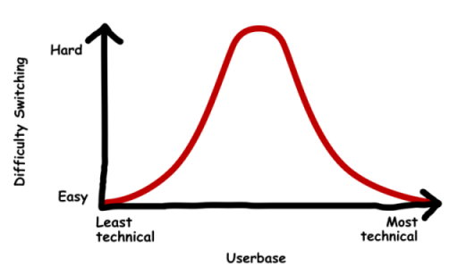

As Windows 10 approaches end-of-life in 2025, people begin to scramble for alternatives. One particular popular options is of course, Linux! After-all it is really the closest and viable options. (Unless you can afford a Mac, in which case good for you!)

But come on, talk is cheap! How many people would actually end up switching to Linux as their operating system? Well we may never know that for sure, but I do have some rough idea for the distribution of users that would end up succeeding switch to Linux, or heck, even just switching away from their primary operating system.

It's not some rocket science, and I've seen some people begin to take notice already, but that's how I like to view the difficulty as:

## The leftmost
The leftmost portion of users are pretty much your average computer users. They have absolutely no interest into what OS they are running as long as they can get their job done, and chances are that *you, the reader* had once been picked as the go-to person to fix any of their "computer problems".  

But what do they actually need? Surprisingly not much, just checking their email, browsing websites, getting in touch with their friends via social media, and probably some light document processing.  
Finding alternative applications for these shouldn't be hard... or perhaps you don't even need to since pretty much everything now lives inside your web browser!

Now whether putting that much responsibility onto the web is a good idea in the first place is certainly discussion-worthy, but for now this is the reality we live in, and based on that reality, you only need a web browser for most tasks, which surprisingly works well across different Operating Systems.  
If they do need document processing, LibreOffice (Which is preinstalled on most distros) will do the job in almost all cases.

For them, it will pretty much function exactly as whatever OS they are using now, albeit with a slightly different user interface. These are the people that's very trivial to get them to switch.

## The middle
The middle portion consists of mainly power user, as well as more tech people. They usually have a particular vision about how they specifically want to use their computer, and make use of advanced features/programs within their current OS to achieve such means.  
This would also mean that they are more likely to have *relatively* unconventional hardware setup, such as dual-monitor/dual GPU, further complicating the process.

But technical challenges is only a part of it! Power users likely spent years upon years of using their system in order to get to the knowledge and expertise they have now. They think that their current system setup is, as far as they are aware, as perfect as it can be. They don't like getting told that "no you actually can't make it the way you are used to" because clearly they have *already* achieved that with their current setup.

Moreover they are more likely to use their existing knowledge to try to have an analogy when understanding new concepts in other operating systems given their expertise, when in reality the analogy may be flawed. It's like finding a dump truck then thinking it's the closest thing to a car because it's the only thing that appears to you at first glance.  
All of that makes power users more difficult to make the switch, both for technical and psychological reasons.  

When I made the switch back in 2021, I was very precisely in this group, and the initial switch is nothing but painful. However I've got pass it with some dedication, and now I lie back somewhere between the left and the middle in the chart.

I think it's helpful to be more open-minded when exploring alternative options, and throw all your past experience away and pretend that you don't actually know anything about the new thing, because chances are that you don't actually fully understand the new thing.

## The rightmost
I don't think I've met any of them personally, but these are highly technical/intelligent people who are almost completely unbothered by the switch. Maybe something like the middle, but without the psychological factor at play?  
They already accepted that things are just the way it is, they don't go to comment section and pester people to use X because X is the best. Any software that does the job that matters the most to them is a software they will use.

Some are pretty [mild](https://www.youtube.com/@ThePrimeTimeagen), some are pretty [wild](https://www.youtube.com/watch?v=TkkKNfYKJJg&t=3292s), pick your fighter :)

These people should have little barriers switching their OSes, in the sense that *if they want to* they will switch and they *will* find a way to live off of it. However I'd imagine it would be pretty difficult to convince them to switch if they don't see the benefits that's relevant to them however.