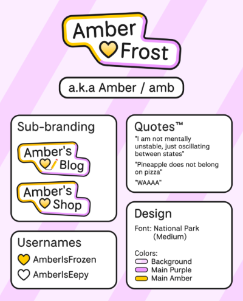

So there it is, I've finally thrown away the **LX86** name I've been known for years.  
It's not something I do often, in-fact it's not something I've *ever* done before, not with this magnitute of changes at least.

# A little backstory
The name **LX86** came to be when I joined a little tech community on Discord when I was small (Talking about 2016-ish~). At the time we aren't *necessarily* the most mature person ever, so we all just have random operating system names, stuff like **Windows 2000**, **Windows XP** and the list goes on and on...  
Initially I settled on **Windows ME**, but decided to differentiate myself from others, so I ended up with **Lubuntu**, a Linux distribution.

Over-time I started adding little stuff to it, like appending a **x86** or **x86_64** at the end. I've also settled with other nicknames such as **LXQt**, but ultimately decided that it's better to give myself a more unique nickname. This is where LX86 comes from, it's an abbreviation of **L**ubuntu **x86**.

I was quite ok with it at the time, having a short nickname is pretty cool... until the Twitter buyout happened. With concerns about the future of the platform, many people scrambled to find alternatives, and one of them is **Mastodon**, and in turn the Fediverse as a whole.

I didn't really paid much attention to it, but ultimately this is where most of my friends went at the time, so I have decided to hop on there and see what's going on.

There's a lot of good memories and there's a lot of bad memories, however it is undeniable that it changed a lot of how i percept about things. It gave me a glimpse to the cruel world and the lies we live by everyday, and it give a glimpse of all the cool, lovely and supportive people that exists around the world, and that's when i realized that LX86 might not be representative of anything, at all...

# Welcome, Amber~
How did I came up with the name? I honestly have no idea at all! I always liked Amber as a name, and one day I was thinking about a what-if situation and came up with **AmberFrost**, and it kinda stuck to me since...

Still I didn't believe it's the best name I could've chose at the time, so I assigned this name to an Alt account of mine, *little did i know it was already deeply-rooted to myself.*

The final push however is when one of the people I know also went with a new name, that's when I've decided that it's finally time to do something about it, especially with the summer break coming. (Meaning, free time I could burn!)

One thing I very explicitly avoided is tying my name with my profile picture, because as it turns out you'll need to re-design the entire thing even if you just want to be called something else, and that is time consuming!

Ultimately I've resorted to a strategy called **finding profile pictures from the internet**, wow exciting isn't it!  
Note that I have delibrately not included the profile picture in here (The blog & blog post) as it may change any time! Though for platforms that do, I should have already included the link to the original profile picture either in my description or in my bio~

As for what kind of visual branding should I take? I sort of just made it up last minute, but I quite liked it for now!

### But what about the domain?
This is where I debated a bit with my past post: [Domain is a long term commitment](/blog/2025-01-09-domain-is-a-long-term-commitment)

On one hand there's a huge cost of switching domain, as well as the inconveniences it brings up to potential visitors. On the other hand, I feel like LX86 is never something I really "enjoyed" living by, so I'd like to get rid of it entirely.

I don't know where should I sit on this, but for now I've decided to keep using the **lx862.com** domain as it's the most chaos-free options I have... After-all I still have *many, many* things I need to adapt to my new name!

# Conclusion
I think that's it! I am not sure how determined I am on sticking with this name (Never try to predict the future!), but for now I am quite happy with it ^^

As a side note, I have a decent amount of blog posts which are either overdue or just abandoned mid-way. I really wish to finish them but I'll see if I have the energy to continue with those, for now you get this lil update as a treat~